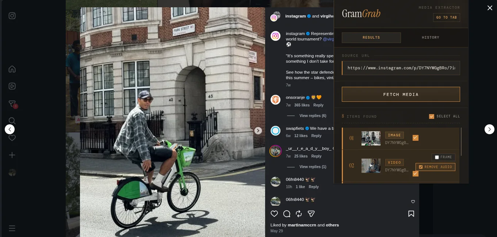
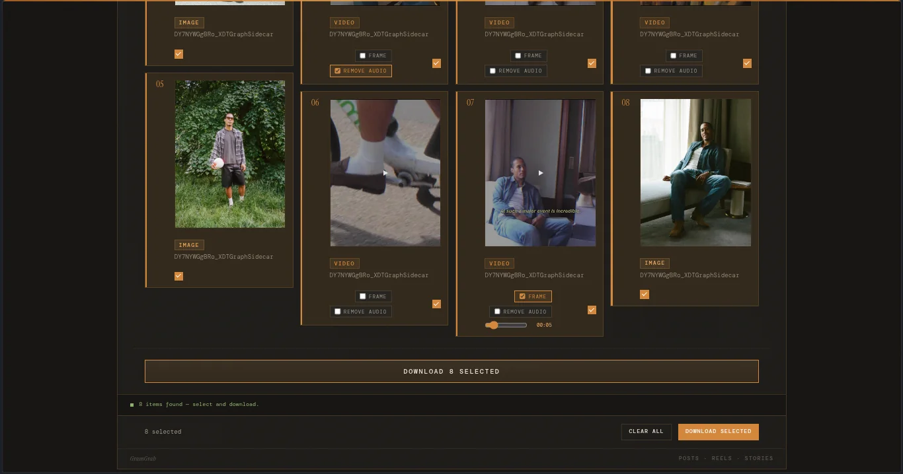

# GramGrab

**GramGrab** is a browser extension (Chrome & Firefox, Manifest V3) that lets you download media from Instagram directly from your browser - posts, carousels, reels, stories, highlights, and profile pictures - with a clean, minimal UI and no third-party services.



Operation failures use stable symbolic codes and action-led recovery. See [the error model](docs/error-model.md) for the canonical registry and diagnostics policy.

---

## Features

- **Posts & Carousels** - download single images or every image in a multi-photo post at once
- **Reels** - save short-form video content as MP4
- **Stories** - download active stories from any accessible profile
- **Highlights** - save archived story highlights
- **Profile pictures** - fetch the highest-resolution profile picture available
- **Batch selection** - cherry-pick which items to download from any result set
- **Preview thumbnails** - see images and videos before you download
- **Auto-detect URL** - the popup reads the URL of your active Instagram tab automatically
- **Export video frame** - choose a timestamp and download a JPEG still instead of the MP4
- **Silent video export** - create a video-only MP4 when the source contains an audio track
- **Download history** - review accepted downloads, remove entries, clear history, and redownload an item
- **Workspace tab** - move large result sets and active batches from the popup into a dedicated tab
- **Dark/light theme** - follows your OS preference



_Open larger collections in GramGrab's responsive workspace to preview, configure, and batch-download media._

---

## Requirements

- **Google Chrome** 88+ or **Mozilla Firefox** 109+
- An active, logged-in Instagram session in the same browser profile
- Node.js 22+ plus the Vite+ CLI workflow (only if building from source)

> Stories, highlights, and some metadata require that you are logged in to Instagram.

---

## Installation

### Option A - Load the pre-built extension (recommended)

1. Clone or download this repository.
2. Run the build to generate browser-specific output directories:
   ```bash
   vp install
   vp run build            # builds both targets
   # or build individually:
   vp run build:chromium   # → extension/chromium/
   vp run build:firefox    # → extension/firefox/
   ```
3. Load the extension into your browser:

   **Chrome / Edge / Brave**
   - Navigate to `chrome://extensions`
   - Enable **Developer mode** (toggle, top-right)
   - Click **Load unpacked** and select the **`extension/chromium/`** folder

   **Firefox**
   - Navigate to `about:debugging#/runtime/this-firefox`
   - Click **Load Temporary Add-on…**
   - Select any file inside the **`extension/firefox/`** folder (e.g. `manifest.json`)

4. The GramGrab icon will appear in your browser toolbar.

> **Why separate folders?** Chromium MV3 requires a `service_worker` background entry; Firefox MV3 uses `scripts`. The two builds share the same TypeScript source but get different generated `manifest.json` files.

### Option B - Development mode (live rebuild)

```bash
vp install
vp run dev            # live-rebuilds the Chromium target (extension/chromium/)
vp run dev:firefox    # live-rebuilds the Firefox target (extension/firefox/)
```

Then load the matching `extension/chromium/` or `extension/firefox/` folder as an unpacked extension (same steps as above). Reload the extension in the browser after each rebuild.

---

## How to Use

1. **Open Instagram** in a browser tab and navigate to the content you want - a post, reel, story, highlight, or profile page.
2. **Click the GramGrab icon** in your toolbar to open the popup.
   - The URL field auto-fills with the Instagram URL from your active tab. If it doesn't, paste the URL manually.
3. **Click "Fetch Media"** (or press Enter). GramGrab queries Instagram for the available media items.
4. **Review the results.** Each item shows a thumbnail, media type badge (image / video), and a filename hint.
   - Use the **Select All** checkbox or tick individual items.
5. **Click "Download N Selected"** to save the chosen files. Your browser's standard download mechanism handles the rest - files land wherever your browser saves downloads.

### Supported URL formats

| Content type      | Example URL                                              |
| ----------------- | -------------------------------------------------------- |
| Post / carousel   | `https://www.instagram.com/p/ABC123/`                    |
| Reel              | `https://www.instagram.com/reel/ABC123/`                 |
| Story             | `https://www.instagram.com/stories/username/`            |
| Highlight         | `https://www.instagram.com/stories/highlights/12345678/` |
| Profile (picture) | `https://www.instagram.com/username/`                    |

---

## Building from Source

```bash
# Install dependencies
vp install

# Production builds
vp run build            # cached builds for both targets
vp run build:chromium   # → extension/chromium/
vp run build:firefox    # → extension/firefox/

# Package Firefox extension as XPI
vp run package:firefox   # → extension/firefox/gramgrab.xpi
# Package Chromium extension as CRX
vp run package:chromium  # → extension/chromium/gramgrab.crx

# Watch mode (rebuilds on save)
vp run dev              # Chromium watch (extension/chromium/)
vp run dev:chromium     # same as above
vp run dev:firefox      # Firefox watch (extension/firefox/)

# Run tests
vp test run
vp test

# Lint & format
tsc --noEmit
vp lint .
vp lint . --fix
vp fmt .
vp fmt --check .
```

The Vite build root is `templates/`; `templates/popup.tsx` mounts the React popup, while `src/background.ts` is bundled directly as a JS module entry (no HTML wrapper). A post-build script generates browser-specific `manifest.json` files and copies icons into the output directories. Vite+ task caching is configured for the browser build and packaging workflows, so repeated `vp run build:*` and `vp run package:*` commands can replay cached outputs when inputs have not changed. See [`docs/ARCHITECTURE.md`](docs/ARCHITECTURE.md) for a deeper look at the codebase structure.

---

## How It Works

GramGrab has a popup surface, a background worker, and shared domain modules:

- **Popup UI** - `templates/popup.html` loads `templates/popup.tsx`, which mounts the React app from `src/popup.tsx`. It handles URL input, media listing, selection, previews, frame and silent-video choices, history, workspace actions, and status feedback.
- **Background service worker** (`src/background.ts`) - handles Instagram requests, strict response decoding, browser downloads, history persistence, context-menu commands, and workspace coordination.
- **Shared modules** - `src/effect/` contains request and schema code, `src/errors/` maps failures to recovery actions, and the `src/history/`, `src/workspace/`, `src/download/`, `src/frame-export/`, and `src/silent-video/` modules keep stateful workflows explicit and testable.

The popup sends messages to the background worker through the single dispatcher in `src/background.ts`. The main operations are `FETCH_MEDIA`, `GET_PREVIEW_URL`, `FETCH_VIDEO_BLOB`, `DOWNLOAD_MEDIA`, history reads and mutations, `RECORD_FRAME_EXPORT`, `RECORD_SILENT_EXPORT`, and diagnostics export. Workspace handoff uses a versioned, short-lived storage transfer coordinated by `src/workspace/coordinator.ts`, so a popup can open or replace a dedicated workspace tab without losing its current source, results, or export settings. The worker fetches media metadata from Instagram using your authenticated browser session, decodes the response, and returns normalized media items to the popup. The listener is registered synchronously and keeps asynchronous work alive with `sendResponse` plus `return true` for Chromium and Firefox compatibility.

> GramGrab does not use an application backend or third-party analytics service. The extension makes requests from your browser to Instagram endpoints and the `fbcdn.net` media CDN, using the browser's authenticated session where required. It stores download history and short-lived workspace handoff data in the browser's extension storage; media URLs and diagnostics can also exist transiently in in-memory UI state while an operation is active.

---

## Permissions

| Permission                  | Why it's needed                                                   |
| --------------------------- | ----------------------------------------------------------------- |
| `downloads`                 | Save media files and debug exports to disk                        |
| `storage`                   | Persist download history and workspace handoff state              |
| `activeTab`                 | Temporarily access the current tab when GramGrab is invoked       |
| `tabs`                      | Read and manage tabs for URL detection and the GramGrab workspace |
| `contextMenus`              | Add GramGrab actions to page and link context menus               |
| `https://*.instagram.com/*` | Fetch media metadata from Instagram                               |
| `https://*.fbcdn.net/*`     | Load media previews and videos from Instagram’s CDN               |

---

## Refreshing Instagram API schemas

GramGrab decodes every Instagram API response through strict Effect schemas. If Instagram changes their response format, the extension will surface a clear message: _"Instagram changed their response format. The extension needs an update."_

If the request itself stopped working because Instagram changed an App ID, ASBD ID, GraphQL
identifier, endpoint, or transport, follow the
[Instagram protocol refresh guide](docs/instagram-protocol.md) first.

To fix it:

1. Configure capture subjects in the repository-root `.env` (copy `.env.example` if needed).
2. Run `vp run generate:ig-fixtures`, then paste `.local/capture-ig-fixtures.mjs` into DevTools on
   `https://www.instagram.com` (logged in).
3. Download the raw JSON files into `.local/raw-fixtures/` and sanitize them before replacing
   anything in `src/effect/__fixtures__/`. Run `vp run sanitize:ig-fixtures` to validate and stage
   the complete capture set, review the value-free output, then run
   `vp run sanitize:ig-fixtures -- --write` to install all eight sanitized fixtures transactionally.
   The sanitizer is the privacy boundary for committed captures.
4. Run `vp test run` - failing tests show exactly which fields changed.
5. Update `src/effect/schemas.ts` to match the new shape, re-run tests, ship only sanitized fixtures.

---

## Limitations

- **Login required** - you must be logged in to Instagram in the same browser profile. Private content is only accessible if your account follows that profile.
- **API fragility** - GramGrab uses Instagram's internal, undocumented GraphQL endpoints. Instagram may change these without notice, which can break fetching until the extension is updated.
- **Time-limited CDN URLs** - Instagram media URLs expire after a few hours. Downloads initiated through GramGrab must complete before the URL expires.
- **Local download history** - GramGrab records accepted downloads locally in extension storage. It
  stores the canonical source URL, media identity, filename hint, export mode, and timestamp, but not
  the temporary media or preview URL. History is capped at 1,000 entries and can be deleted from the
  popup.
- **Workspace lifetime** - workspace transfers are short-lived handoffs between the popup and a
  dedicated extension tab. They expire after 60 seconds and are sanitized before being written to
  extension storage.
- **File formats** - images are always saved as `.jpg` and videos as `.mp4`, matching the formats Instagram serves.

---

## Contributing

Pull requests are welcome. Before submitting, run `vp check`, `vp test run`, and `vp run fallow`. Build both browser targets with `vp run build:chromium` and `vp run build:firefox`. The project uses Vite+ as the primary workflow surface, so prefer `vp` commands over package-manager wrappers when developing locally or in CI.

### Dependency policy

The committed `pnpm-lock.yaml` is authoritative for reproducible installs. CI uses `vp install --frozen-lockfile` and fails when dependency declarations and the lockfile drift.

Vite+, its Vite core alias, and its Vitest alias are a coordinated pre-1.0 toolchain. Their exact versions in `package.json` and the overrides must be updated together. Dependabot checks npm dependencies weekly and groups these three packages in a single pull request. Dependency updates are never merged automatically: validate each update with `vp check`, `vp test run`, both production builds, and `vp run fallow` before merging.

---

## Disclaimer

This extension is an independent project and is not affiliated with, endorsed by, or connected to Instagram or Meta in any way. Use it responsibly and in accordance with [Instagram's Terms of Use](https://help.instagram.com/581066165581870). Only download content you have the right to access and save.
