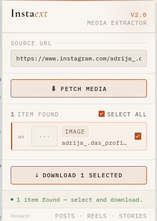

# Instaext

**Instaext** is a browser extension (Chrome & Firefox, Manifest V3) that lets you download media from Instagram directly from your browser — posts, carousels, reels, stories, highlights, and profile pictures — with a clean, minimal UI and no third-party services.



---

## Features

- **Posts & Carousels** — download single images or every image in a multi-photo post at once
- **Reels** — save short-form video content as MP4
- **Stories** — download active stories from any accessible profile
- **Highlights** — save archived story highlights
- **Profile pictures** — fetch the highest-resolution profile picture available
- **Batch selection** — cherry-pick which items to download from any result set
- **Preview thumbnails** — see images and videos before you download
- **Auto-detect URL** — the popup reads the URL of your active Instagram tab automatically
- **Dark/light theme** — follows your OS preference

---

## Requirements

- **Google Chrome** 88+ or **Mozilla Firefox** 109+
- An active, logged-in Instagram session in the same browser profile
- Node.js 18+ and npm (only if building from source)

> Stories, highlights, and some metadata require that you are logged in to Instagram.

---

## Installation

### Option A — Load the pre-built extension (recommended)

1. Clone or download this repository.
2. Run the build to generate browser-specific output directories:
   ```bash
   bun install
   bun run build           # builds both targets
   # or build individually:
   bun run build:chromium  # → extension/chromium/
   bun run build:firefox   # → extension/firefox/
   ```
3. Load the extension into your browser:

   **Chrome / Edge / Brave**
   - Navigate to `chrome://extensions`
   - Enable **Developer mode** (toggle, top-right)
   - Click **Load unpacked** and select the **`extension/chromium/`** folder

   **Firefox**
   - Navigate to `about:debugging#/runtime/this-firefox`
   - Click **Load Temporary Add-on…**
   - Select any file inside the **`extension/firefox/`** folder (e.g. `manifest.json`)

4. The Instaext icon will appear in your browser toolbar.

> **Why separate folders?** Chromium MV3 requires a `service_worker` background entry; Firefox MV3 uses `scripts`. The two builds share the same TypeScript source but get different generated `manifest.json` files.

### Option B — Development mode (live rebuild)

```bash
bun install
bun run dev            # live-rebuilds the Chromium target (extension/chromium/)
bun run dev:firefox    # live-rebuilds the Firefox target (extension/firefox/)
```

Then load the matching `extension/chromium/` or `extension/firefox/` folder as an unpacked extension (same steps as above). Reload the extension in the browser after each rebuild.

---

## How to Use

1. **Open Instagram** in a browser tab and navigate to the content you want — a post, reel, story, highlight, or profile page.
2. **Click the Instaext icon** in your toolbar to open the popup.
   - The URL field auto-fills with the Instagram URL from your active tab. If it doesn't, paste the URL manually.
3. **Click "Fetch Media"** (or press Enter). Instaext queries Instagram for the available media items.
4. **Review the results.** Each item shows a thumbnail, media type badge (image / video), and a filename hint.
   - Use the **Select All** checkbox or tick individual items.
5. **Click "Download N Selected"** to save the chosen files. Your browser's standard download mechanism handles the rest — files land wherever your browser saves downloads.

### Supported URL formats

| Content type      | Example URL                                              |
| ----------------- | -------------------------------------------------------- |
| Post / carousel   | `https://www.instagram.com/p/ABC123/`                    |
| Reel              | `https://www.instagram.com/reel/ABC123/`                 |
| Story             | `https://www.instagram.com/stories/username/`            |
| Highlight         | `https://www.instagram.com/stories/highlights/12345678/` |
| Profile (picture) | `https://www.instagram.com/username/`                    |

---

## Building from Source

```bash
# Install dependencies
bun install

# Production builds
bun run build           # builds both targets
bun run build:chromium  # → extension/chromium/
bun run build:firefox   # → extension/firefox/

# Watch mode (rebuilds on save)
bun run dev             # Chromium watch (extension/chromium/)
bun run dev:chromium    # same as above
bun run dev:firefox     # Firefox watch (extension/firefox/)

# Run tests
bun run test
bun run test:watch

# Lint & format
bun run lint
bun run lint:fix
bun run format
bun run format:check
```

The Vite build root is `templates/`; `src/background.ts` is bundled directly as a JS module entry (no HTML wrapper). A post-build script generates a browser-specific `manifest.json` and copies icons into the output directory.

---

## How It Works

Instaext is built on two parts:

- **Popup UI** — a React app (`src/App.tsx`) rendered inside the extension popup. It handles URL input, media listing, selection, and status feedback.
- **Background service worker** (`src/background.ts`) — handles all network requests to Instagram's internal GraphQL API and triggers browser downloads via `browser.downloads.download()`.

The popup sends messages to the background worker (`FETCH_MEDIA`, `DOWNLOAD_MEDIA`, `GET_PREVIEW_URL`). The worker fetches media metadata from Instagram using your authenticated browser session (cookies are included automatically), parses the response, and returns normalized media items to the popup.

> Instaext never sends your data anywhere except directly to Instagram's own servers. All requests go from your browser to `instagram.com` and `fbcdn.net` (Instagram's media CDN).

---

## Permissions

| Permission                  | Why it's needed                                            |
| --------------------------- | ---------------------------------------------------------- |
| `downloads`                 | Save media files to disk                                   |
| `activeTab`                 | Read the URL of the current tab to auto-fill the URL field |
| `tabs`                      | Query tab information                                      |
| `storage`                   | Extension storage                                          |
| `scripting`                 | Content script capability                                  |
| `https://*.instagram.com/*` | Fetch media metadata                                       |
| `https://*.fbcdn.net/*`     | Load media previews from Instagram's CDN                   |

---

## Limitations

- **Login required** — you must be logged in to Instagram in the same browser profile. Private content is only accessible if your account follows that profile.
- **API fragility** — Instaext uses Instagram's internal, undocumented GraphQL endpoints. Instagram may change these without notice, which can break fetching until the extension is updated.
- **Time-limited CDN URLs** — Instagram media URLs expire after a few hours. Downloads initiated through Instaext must complete before the URL expires.
- **No download history** — Instaext does not track what you have previously downloaded.
- **File formats** — images are always saved as `.jpg` and videos as `.mp4`, matching the formats Instagram serves.

---

## Contributing

Pull requests are welcome. Please run `bun run lint:fix` and `bun run format` before submitting.

---

## Disclaimer

This extension is an independent project and is not affiliated with, endorsed by, or connected to Instagram or Meta in any way. Use it responsibly and in accordance with [Instagram's Terms of Use](https://help.instagram.com/581066165581870). Only download content you have the right to access and save.
