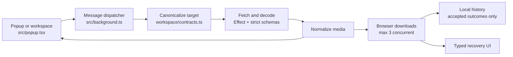

# GramGrab architecture

> Living architecture reference
> Last updated: 2026-07-17

GramGrab is a Manifest V3 browser extension with a React popup, a background worker, strict Instagram response decoding, and explicit workflows for downloads, history, workspace handoff, and media transformation.

- Chrome and Firefox MV3
- No content scripts
- Effect schemas at the Instagram network boundary
- Local-only history and short-lived workspace transfer state
- Separate browser manifests generated after the shared build

## WHAT IT IS

GramGrab turns an Instagram URL into normalized media items and then into browser download operations. The UI runs either in the extension popup or in a dedicated workspace tab. The background worker owns network access, browser downloads, context menus, and durable storage.

### Runtime entry points

| Boundary              | Entry point               | Responsibility                                                                                                                      |
| --------------------- | ------------------------- | ----------------------------------------------------------------------------------------------------------------------------------- |
| Popup HTML            | **templates/popup.html**  | Loads the popup document and stylesheet.                                                                                            |
| Popup bootstrap       | **templates/popup.tsx**   | Mounts the React app from **src/popup.tsx**.                                                                                        |
| UI                    | **src/popup.tsx**         | URL input, media results, previews, selection, frame and silent-video choices, history, workspace actions, and status feedback.     |
| Background worker     | **src/background.ts**     | Instagram requests, strict decoding, browser downloads, history, context menus, workspace coordination, and one message dispatcher. |
| Build post-processing | **scripts/postbuild.mjs** | Writes browser-specific manifests and copies extension assets.                                                                      |

The same React surface detects popup versus workspace mode from the URL. The worker is bundled directly as **js/background.js**, without an HTML wrapper.

### Trust boundary

There is no content script and no application backend. The worker requests Instagram data and media from the browser using the extension's host permissions and authenticated session. Durable local data is limited to validated history and short-lived workspace transfer state.

## HOW IT WORKS

The runtime is a message-driven pipeline. URL canonicalization happens before a request is made, API responses cross an Effect Schema boundary, and downloads are tracked as operations so accepted, failed, skipped, and not-attempted outcomes remain distinct.



The UI receives normalized values and operation results, not raw Instagram response objects.

### Request and response lifecycle

1. **UI** canonicalizes and sends FETCH_MEDIA with a candidate Instagram URL. Active-tab detection and context-menu commands use the same canonical URL rules.
2. **Worker** routes by message type. For media fetches, it selects target-specific configured protocol requests, retries supported transient failures, decodes through the matching strict schema, and normalizes known media variants.
3. **Worker** reads history to attach per-item markers. The response contains stable indexes, optional media IDs, safe filename hints, preview URLs, dimensions, and a typed failure when recovery is possible.
4. **UI** renders previews and selection controls. Frame export fetches a video blob and extracts a JPEG in the UI. Silent-video export can move a batch into the workspace for the worker-backed media pipeline.
5. **Worker** receives direct operations, caps browser download concurrency at three, records only accepted downloads, and returns a correlated result for every operation.

### Message surface

| Message or group     | Owner              | Purpose                                                                       |
| -------------------- | ------------------ | ----------------------------------------------------------------------------- |
| FETCH_MEDIA          | Worker             | Fetch and normalize post, reel, story, highlight, or profile media.           |
| GET_PREVIEW_URL      | Worker             | Fetch a fallback data URL when a CDN preview cannot load directly.            |
| FETCH_VIDEO_BLOB     | Worker             | Fetch a service-worker-safe data URL for frame metadata and extraction.       |
| DOWNLOAD_MEDIA       | Worker             | Start direct browser downloads and append accepted history records.           |
| History messages     | Worker and storage | Read, redownload, delete, and clear local history.                            |
| Export messages      | Worker and UI      | Record frame or silent exports after the derived file is created.             |
| Diagnostics messages | Worker and UI      | Fetch a raw shape for debugging and download a user-approved JSON diagnostic. |

The listener is registered synchronously when the worker module evaluates. It uses sendResponse plus return true to keep asynchronous work alive across Chromium and Firefox.

## WHY IT WAS BUILT THIS WAY

These decisions are visible in the implementation and tests. They reduce browser variance and keep Instagram's undocumented response shape at one explicit boundary.

### No content scripts

The extension uses active-tab URL access, context-menu metadata, and host-permission requests. It does not inject code into Instagram pages. That keeps the permission and lifecycle model smaller and avoids a second page-to-extension message boundary.

### Synchronous worker registration

**src/background.ts** registers context-menu and runtime message listeners during module evaluation. MV3 workers can start on demand, so handlers must exist as soon as the worker module starts.

### Callback response contract

The dispatcher uses sendResponse plus return true instead of returning a Promise from the listener. This is the cross-browser-safe pattern documented in the source and keeps the worker alive while asynchronous operations finish.

### Strict schemas with tolerant typenames

Known variants require their required fields and fail loudly as ResponseShapeUnknown when Instagram changes a shape. Unknown typename values pass through so a partial Instagram rollout does not discard every other usable item.

### Effect at external boundaries

Network, HTTP, GraphQL, rate-limit, and schema failures are typed Effects. The worker converts them at the edge into the operation failure registry. Tests exercise the same behavior without requiring a live Instagram session.

### Operation identity and reconciliation

Every download has an immutable operation ID and a fresh request ID on retry. History stores accepted outcomes only. Redownload reconciliation prefers stable media IDs before falling back to item index and media type.

> **Rejected shortcut:** raw casts at the Instagram boundary would make upstream changes look like successful empty results. The schema posture intentionally trades a visible update-required failure for silent corruption or a misleading download.

## DATA SHAPES

External data is decoded before it enters the application model. Durable data has separate contracts and is sanitized before storage.

| Shape                 | Defined in                     | Important invariants                                                                                                                                            |
| --------------------- | ------------------------------ | --------------------------------------------------------------------------------------------------------------------------------------------------------------- |
| CanonicalInstagramUrl | **src/workspace/contracts.ts** | HTTPS www.instagram.com, supported target, normalized path, no fragment, and only the supported carousel query.                                                 |
| MediaItem             | **src/background.ts**          | Normalized image or video URL, stable item index, filename hint, optional media identity, preview, dimensions, and capture timestamp.                           |
| WorkspaceSnapshot     | **src/workspace/contracts.ts** | Versioned, expiring handoff containing source, settled status, selected media, frame settings, and silent-export indexes. Data URLs are removed before storage. |
| DownloadHistoryEntry  | **src/history/contracts.ts**   | Canonical source and item identity plus filename/export metadata and accepted timestamp. No media or preview URL. Capped at 1,000 records.                      |
| OperationFailure      | **src/errors/contracts.ts**    | Stable code, phase, and scope. Presentation maps codes to recovery actions; diagnostic causes stay out of ordinary UI copy.                                     |

### Versioned workspace handoff

```text
popup state
  -> sanitizeSnapshot()
  -> browser.storage.local[workspace-transfer-v1]
  -> workspace tab claims and removes the transfer
  -> upgradeWorkspaceSnapshot() accepts versions 1, 2, and 3
  -> React state resumes the source, results, and export settings
```

The transfer is temporary. WORKSPACE_TRANSFER_TTL_MS is 60 seconds, and the status heartbeat is removed when the workspace tab closes or leaves workspace mode.

## DEPENDENCIES AND ASSUMPTIONS

### Browser platform

The **src/lib/browser.ts** shim resolves Firefox's native browser first, then wraps Chromium's callback APIs, then falls back to a no-op test shim. Production behavior assumes MV3 downloads, storage, tabs, windows, and context-menu APIs are available.

### Instagram session

Stories, highlights, private content, and some profile data depend on an authenticated browser session. Instagram's internal endpoints, identifiers, headers, and response shapes are undocumented and may change independently of the extension.

### Media delivery

CDN URLs are temporary and are passed to browser downloads only while usable. Preview fallback and video-blob fetches use the worker because service workers do not provide every DOM URL API.

### Build and release

**templates/** is the Vite root. **scripts/postbuild.mjs** writes browser manifests. Vite+ is the repository's workflow surface for builds, checks, tests, and packaging.

### Permission model

The generated manifests request:

- downloads for media and debug exports
- storage for history and workspace handoff state
- activeTab for temporary access to the active tab
- tabs for URL detection and workspace tab management
- contextMenus for page and link actions
- <https://*.instagram.com/*> for Instagram metadata
- <https://*.fbcdn.net/*> for Instagram CDN previews and video data

The source of truth is **scripts/manifest.mjs**. The README permission table mirrors it.

## FAILURE MODES

| Failure class                            | Where detected                                 | Recovery posture                                                                                                                                                   |
| ---------------------------------------- | ---------------------------------------------- | ------------------------------------------------------------------------------------------------------------------------------------------------------------------ |
| Invalid or unsupported URL               | Canonicalization and history source validation | Return an input-scoped failure before making a network request.                                                                                                    |
| Network, HTTP, auth, or rate limit       | Effect request helpers                         | Retry supported transient failures, preserve rate-limit semantics, and present a typed action such as refetch or open Instagram.                                   |
| Unknown Instagram response shape         | Effect Schema decode                           | Return ResponseShapeUnknown with endpoint context. Update protocol configuration, sanitized fixtures, and schemas together.                                        |
| Browser download rejection               | Worker download operation                      | Return a correlated failed result without exposing the raw cause as ordinary UI copy. The UI can retry the failed operation or download originals where supported. |
| History storage failure or newer version | History repository and handlers                | Keep the download outcome visible, add a warning when history could not be saved, and refuse destructive writes for an unknown future store version.               |
| Frame extraction failure                 | DOM video and canvas extraction                | Classify no-duration, no-frame, no-canvas, no-blob, and timeout cases. A timeout gets one retry; the UI offers original-download recovery.                         |
| Silent-video worker failure              | OPFS and worker batch                          | Retain input where a later retry needs it, remove failed generated output, and preserve the failure kind through the correlated batch result.                      |

### Diagnostics are opt-in

Diagnostics can include the source URL, temporary media URLs, filenames, operation IDs, technical messages, and stacks. The UI previews the payload before copying it and warns the user to share it only with someone trusted.

## TESTS AND EVALUATIONS

The test suite mirrors the architecture boundaries instead of relying on one end-to-end happy path.

| Area               | Coverage                                                                                                                                                                                                |
| ------------------ | ------------------------------------------------------------------------------------------------------------------------------------------------------------------------------------------------------- |
| Boundary contracts | **src/effect/schemas.fixtures.test.ts** decodes sanitized captures. **src/effect/schemas.test.ts** covers missing required fields, null variants, union dispatch, and unknown typename passthrough.     |
| Worker behavior    | **src/background.test.ts** verifies synchronous listener registration, async response behavior, context menus, shortcode fallback, download concurrency, correlated failures, history, and diagnostics. |
| Stateful workflows | Download attempts, history reconciliation, workspace transfer, frame extraction, OPFS cleanup, silent-video processing, and browser shim tests exercise identity, retries, expiry, and cleanup rules.   |
| Integration        | **src/integration.test.tsx** covers fetch, render, preview fallback, and download flows through the user-facing surface.                                                                                |

### Repository validation

| Check                                          | What it protects                                                                 |
| ---------------------------------------------- | -------------------------------------------------------------------------------- |
| vp check                                       | Formatting, lint rules, and TypeScript correctness.                              |
| vp test run                                    | Focused unit, integration, fixture, browser-shim, and media-processing behavior. |
| vp run build:chromium and vp run build:firefox | Browser-specific output, manifests, icons, and background entry wiring.          |
| vp run fallow                                  | Dead code, dependency, cycle, duplication, and complexity signals.               |

When Instagram changes, the supported maintenance loop is: capture in DevTools, sanitize the complete fixture set, decode with fixture tests, update the schema or protocol configuration, and rerun repository checks before shipping.

### Source entry points

- **templates/popup.html**
- **templates/popup.tsx**
- **src/popup.tsx**
- **src/background.ts**
- **scripts/manifest.mjs**
- **src/effect/schemas.ts**
- **src/errors/contracts.ts**
- **src/history/repository.ts**
- **src/workspace/coordinator.ts**
